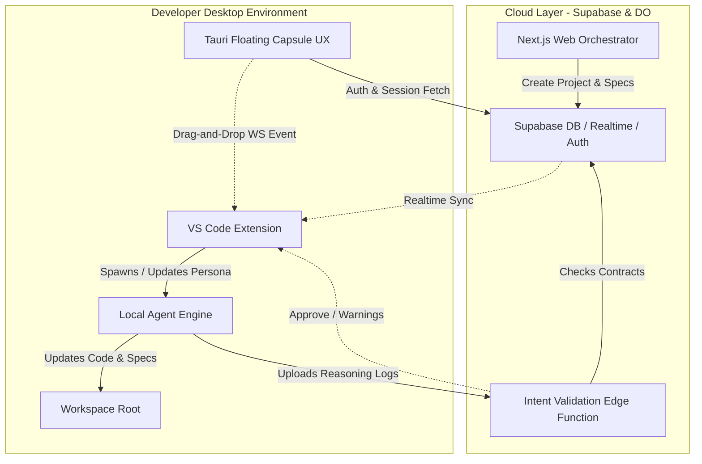
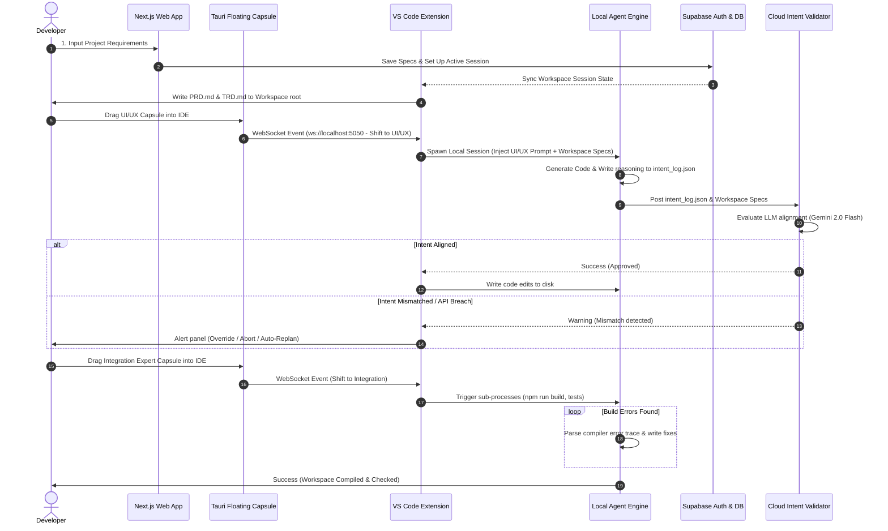
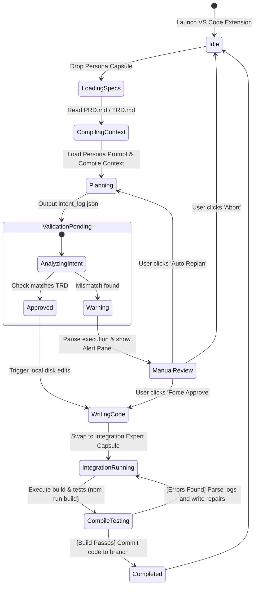
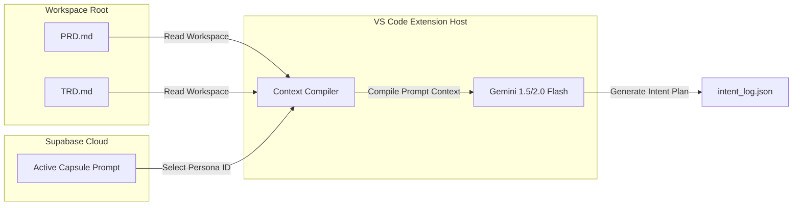

# 🛸 Mini-Agency Orchestrator

> **Transform your local workspace into a self-orchestrating, multi-role software agency under human control.**

The **Mini-Agency Orchestrator** is an automated Software Development Life Cycle (SDLC) platform. It merges a **Web Orchestrator**, a **Floating Capsule Desktop Overlay**, and a **Local VS Code Agent Extension** to coordinate a single-session, multi-role developer agent loop. It eliminates common agentic flaws such as context drift, multi-agent code collisions, and out-of-bounds generation.

---

## 💎 The Core Architecture Pillars

```
+-------------------------------------------------------------------------------+
|                                                                               |
|  [1. Local Spec Anchoring] -> [2. Floating Capsule UX] -> [3. Single Session] |
|            |                          |                         |             |
|    PRD/TRD Workspace Files      Drag-Drop Persona Shift   Sequential Prompting|
|                                                                               |
|  [4. Intent Validation Loop] <--------------------------- [5. Integration]   |
|            |                                                    |             |
|    Log Scrapes vs Spec Contracts                        SUBPROCESS Auto-Repair|
|                                                                               |
+-------------------------------------------------------------------------------+
```

1. **Local Spec Anchoring:** When requirements are generated, the platform dumps them as markdown files (`PRD.md`, `TRD.md`, `ARCHITECTURE.md`) directly into the workspace root. This provides a physical, local, un-degradable source of truth.
2. **The Floating Capsule UX:** Role personas (UI/UX, Backend, QA, Security, Integration) are represented as borderless, translucent capsules that float on top of the desktop. Developers drag and drop these capsules directly into the IDE to trigger integration tasks.
3. **Single-Agent, Multi-Role Execution:** Instead of running expensive and chaotic multi-agent environments, our system runs a **single local session** that sequentially shifts roles by injecting targeted system prompts, keeping the context window clean.
4. **The Intent Validation Loop:** To bypass upload bottlenecks and preserve code privacy, the extension scrapes only the agent's internal reasoning logs (`intent_log.json`) and validates them against the TRD contracts in the cloud before any code is written.
5. **The Integration Expert:** A dedicated Tech Lead persona that executes local build commands (like `npm run build`), parses error logs, and recursively repairs compile errors and API route mismatches before final commit.

---

## 🗺️ System Flow & Architecture

### High-Level Block Diagram



### End-to-End Sequence Flow



### Agent Session State Machine
This diagram shows the core transitions of a local agent session as capsules are dropped and validation runs:



### Context Handoff & Prompt Compilation Flow
How local constraints are assembled dynamically inside the extension memory, keeping the cloud database decoupled from actual codebase logic:



---

## 📂 Monorepo Structure

```
├── web/                   # Next.js Web Orchestrator dashboard
├── extension/             # VS Code Extension (TypeScript)
│   ├── src/
│   │   ├── extension.ts   # Main activation and Supabase authPKCE handler
│   │   ├── server.ts      # Local WebSocket Server on port 5050
│   │   ├── runner.ts      # Agent Execution Loop & LLM client wrapper
│   │   ├── http.ts        # Native Node.js HTTPS POST client
│   │   └── prompts.ts     # PM, Architect, and DevOps base prompts
│   ├── .vscode/
│   │   └── launch.json    # Pre-configured workspace debugger launcher
│   └── send-persona.js    # Mock WebSocket client for testing drops
├── tauri-capsule/         # Tauri Desktop Widget (Rust + React)
└── supabase/              # Database schema migrations & config
    └── migrations/
        └── 20260608000000_init.sql # Users, Projects, Sessions, and Capsule schemas
```

---

## 🚀 Getting Started

### 1. Database Setup (Supabase)
Create a project on [Supabase](https://supabase.com) and initialize the tables using the Supabase CLI:
```bash
# Log in to your CLI
supabase login

# Run migrations
supabase migration up
```

### 2. Configure Environment Variables
Create a `.env` file at the root of the workspace:
```bash
# LLM Provider Key (Kept local)
GEMINI_API_KEY="YOUR_GEMINI_API_KEY"

# Supabase Configurations
SUPABASE_URL="https://your-project.supabase.co"
SUPABASE_ANON_KEY="eyJhbGciOi..."
```

### 3. Compile and Debug the VS Code Extension
1. Open the `extension` folder in VS Code.
2. Install dependencies:
   ```bash
   npm install
   ```
3. Compile the typescript codebase:
   ```bash
   npm run compile
   ```
4. Press **`F5`** on your keyboard. This opens an **Extension Development Host** window with the `Service` project workspace pre-loaded.
5. In the new window, open the Command Palette (`Ctrl+Shift+P` on Windows) and run:
   * **`Antigravity Agency: Generate Local Workspace Specs`** (Creates PRD.md & TRD.md)

### 4. Simulating Capsule Drag & Drop (Tauri WebSocket server)
While the Extension Host window is active, run the loopback mock script in your terminal to simulate dragging a capsule:
```bash
node extension/send-persona.js
```
The extension will output a VS Code notification confirming the active persona has shifted to `BACKEND` and loading the workspace specs into the prompt.

---

## 🔒 Security & Performance Features
* **No Code Leaks:** Your proprietary source code does not go to the cloud. Only the planning comments and intent metadata (`intent_log.json`) are validated.
* **PKCE Auth Callback:** Security-focused OAuth redirect handlers (`vscode://antigravity-agency/auth`) bypass iframe and embedded webview restrictions securely.
* **Low Latency:** Using standard native Node.js HTTP handlers instead of wrapper overlays ensures network requests take <1.5s.
