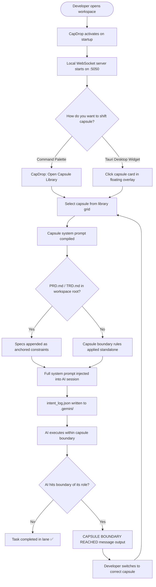
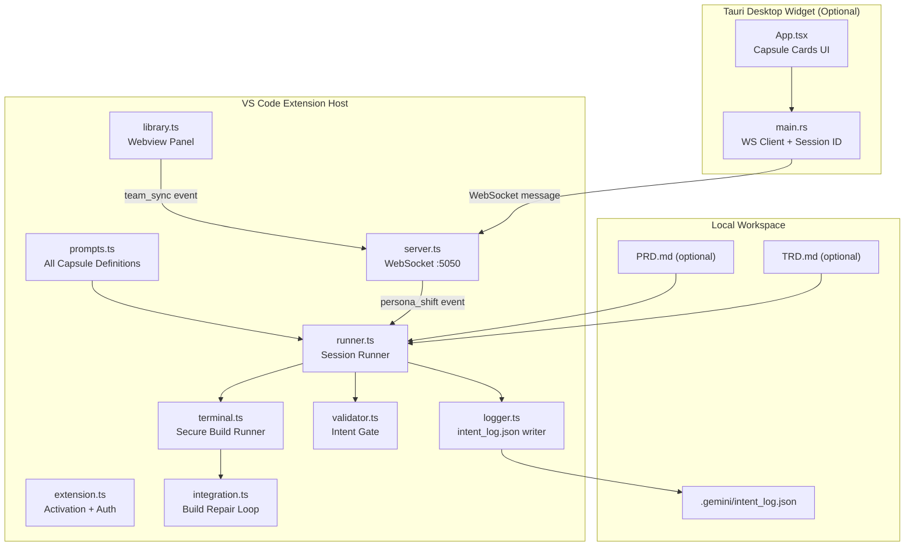
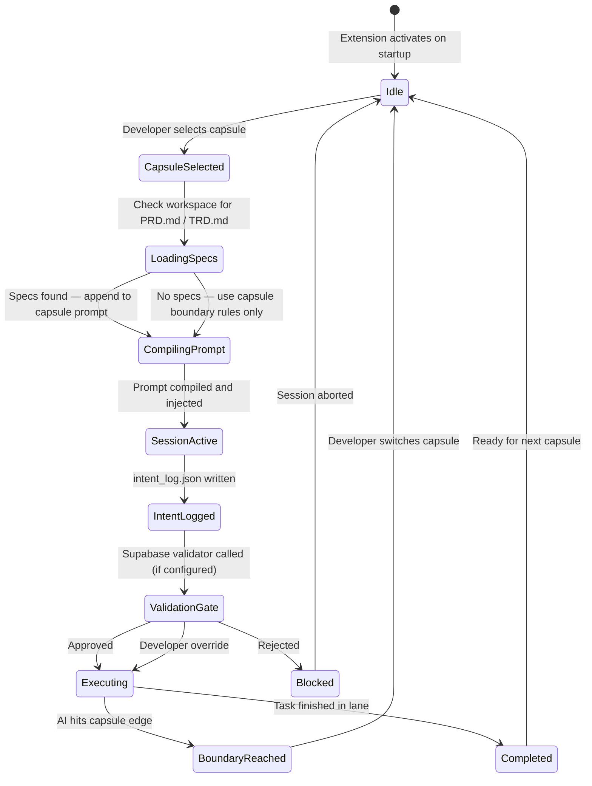

<div align="center">

# CapDrop

**Drop a capsule. Shift your AI's role. Ship better code.**

[](https://marketplace.visualstudio.com/items?itemName=antigravity.capdrop)
[](https://marketplace.visualstudio.com/items?itemName=antigravity.capdrop)
[](LICENSE)
[](CONTRIBUTING.md)

[Install from Marketplace](#installation) · [Contribute a Capsule](CONTRIBUTING.md) · [Report a Bug](https://github.com/your-repo/capdrop/issues)

</div>

---

## The Problem

AI coding assistants are powerful but undisciplined. Ask them to build a login form and you'll get a login form *plus* an auth controller, a database schema, and a session handler you never asked for.

This creates tangled codebases where files are owned by no one, logic lives in the wrong layer, and integration becomes a debugging session.

## The Solution

CapDrop gives your AI a **job title and a contract**. Each **Capsule** is a strict, role-specific system prompt that locks the AI into one lane — and when it hits the edge of its role, it stops and tells you exactly what needs to happen next instead of quietly doing someone else's job.
Drop UI/UX capsule   →  AI builds frontend only
Drop Backend capsule →  AI builds server + database only
Drop QA capsule      →  AI writes tests only, never touches production code

---

## How It Works



---

## Capsules

| Capsule | Role | Allowed Files | Forbidden |
|---|---|---|---|
| 🎨 **React Frontend** | Senior React Engineer | `.tsx`, `.jsx`, `/components`, `/pages`, `/ui` | Server files, database, `.env` |
| ⚙️ **Backend Systems** | Senior Backend Engineer | `server.*`, `db.*`, `/routes`, `/migrations`, `.env` | Any frontend files |
| 🧪 **QA Specialist** | Senior QA Engineer | `*.test.*`, `*.spec.*`, `/tests`, `/e2e` | Any production source code |
| 🔒 **Security Audit** | App Security Engineer | `SECURITY_AUDIT.md` only | All production files |
| 🔗 **Systems Integration** | Integration Auditor | Build configs, import paths, existing files with errors only | New features, new routes |
| 🤪 **Emoji Decorator** | Chaos Frontend Agent | Frontend files — adds emojis | Backend files, anything outside `/ui` |
| 📖 **Code Explainer** | Documentation Engineer | Existing files — adds docstrings only | Any runtime behavior changes |
| 🌸 **Flower Decorator** | Botanical Frontend Agent | Frontend files — adds floral decorations | Backend files |

Every capsule enforces a **hard boundary**. When the AI reaches the edge of its role it outputs:
CAPSULE BOUNDARY REACHED: This task requires backend work.
Please switch to the Backend capsule to complete: [one sentence description].
The frontend scaffold has been built to the extent possible.

---

## Architecture



---

## Capsule Session State Machine



---

## Project Structure
capdrop/
├── extension/                  # VS Code Extension (TypeScript)
│   ├── src/
│   │   ├── extension.ts        # Activation, auth, command registration
│   │   ├── server.ts           # Local WebSocket server :5050
│   │   ├── runner.ts           # Capsule session compiler and runner
│   │   ├── prompts.ts          # ALL capsule definitions live here ←
│   │   ├── logger.ts           # intent_log.json writer
│   │   ├── validator.ts        # Intent validation gate
│   │   ├── terminal.ts         # Secure build command executor
│   │   ├── integration.ts      # Build repair loop
│   │   ├── library.ts          # Capsule Library webview panel
│   │   └── http.ts             # Native Node.js HTTP/HTTPS client
│   ├── icon.png                # Extension icon (128x128)
│   ├── package.json            # Extension manifest
│   ├── README.md               # Marketplace README
│   └── LICENSE                 # AGPL v3
│
├── tauri-capsule/              # Desktop Widget (Rust + React, optional)
│   ├── src/
│   │   ├── App.tsx             # Capsule card UI
│   │   └── main.tsx            # React entry
│   ├── src-tauri/
│   │   ├── src/main.rs         # Rust WS client + session ID generation
│   │   └── tauri.conf.json     # Borderless, always-on-top window config
│   └── package.json
│
└── supabase/                   # Optional cloud validator (self-hosted)
├── functions/
│   └── intent-validator/
│       └── index.ts        # Edge function: validates intent_log vs specs
└── migrations/
└── 20260608000000_init.sql

---

## Installation

### From the Marketplace

Search **CapDrop** in the VS Code Extensions panel or install via:

```bash
code --install-extension antigravity.capdrop
```

### From Source

```bash
git clone https://github.com/your-repo/capdrop
cd capdrop/extension
npm install
npm run deploy
```

---

## Commands

| Command | What it does |
|---|---|
| `CapDrop: Open Capsule Library` | Opens the full capsule grid — browse, select, and manage your active team |
| `CapDrop: Start Active Persona Session` | Starts an agent session with the currently active capsule |
| `CapDrop: Run Integration Expert Build Loop` | Runs a build command with the Integration capsule in a repair loop |

---

## Optional: Tauri Desktop Widget

The floating desktop widget shows your active capsule and lets you switch roles without opening VS Code's command palette.

```bash
cd tauri-capsule
npm run tauri dev
```

Requires [Rust](https://rustup.rs) installed. The widget communicates with the extension over `ws://localhost:5050`.

---

## Optional: Spec Anchoring

Drop a `PRD.md` and/or `TRD.md` in your workspace root. CapDrop appends them automatically to the active capsule's system prompt, giving the AI both role boundaries **and** project-specific constraints.

No specs required — capsule boundaries work standalone.

---

## Privacy

- Source code never leaves your machine
- `intent_log.json` is local only
- No telemetry, no analytics, no accounts required
- No API keys — CapDrop injects prompts into your existing AI assistant

---

## Contributing

Want to contribute a capsule, fix a bug, or suggest a feature?

**See [CONTRIBUTING.md](CONTRIBUTING.md)**

All capsule definitions live in `extension/src/prompts.ts` as entries in `ALL_PERSONAS`. One PR = one capsule.

---

## License

This project is licensed under the **GNU Affero General Public License v3.0 (AGPL-3.0)**.

You are free to use, study, and contribute to this project. Any commercial use, distribution, or derivative work must also be released under AGPL-3.0. For commercial licensing inquiries, open an issue or contact the maintainers directly.

See the [LICENSE](LICENSE) file for full terms.
